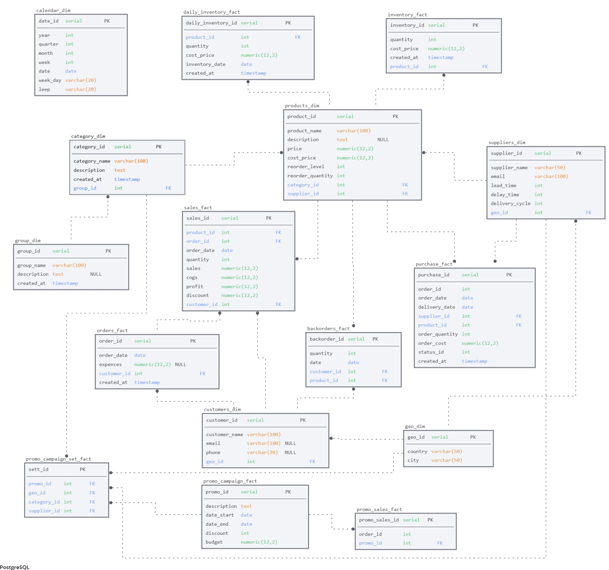

# Learn Project: BI System in Category Management

## Introduction
### Project Goal
The aim of this learning project is to develop the skills and knowledge required for data modelling, collection, analysis and visualization with focus on category management.

### Context
Category management plays a crucial role by optimizing the product assortment and managing inventory. Data analysis allows for making informed decisions based on real metrics and optimizing both in-store and online sales.

## Methods and Tools
### Tools
- PostgreSQL
- SQL, Python, Excel
- Power BI

### Data
Data (sales, inventory, purchasing) has been generated and written to PostgreSQL using Python + SQL.

## Data Analysis
### Data Collection
Description of the data collection process, including data sources and extraction methods for both brick-and-mortar and e-commerce platforms.

### Sales Analysis
Examination of sales data to determine the profitability and performance of various product categories.

### Inventory Analysis
Determination of optimal inventory levels to minimize costs and avoid stockouts, including real-time inventory monitoring.

### Purchasing Analysis

### Data Visualization
Creation of interactive dashboards to visualize KPIs for retail and e-commerce.

## Conclusion
### Summary
Summarization of the project results and their significance for category management.

## Appendices
### Code
Inclusion of SQL and Python scripts used for data analysis.

### Dashboards
Screenshots of interactive dashboards created in Power BI will be presented here.

### Data model

The data model was built on the sqldbm.com platform.